# Translate Any Server & Mod

**ANY SERVER. ANY MOD. YOUR LANGUAGE.**

Translate Minecraft chat, items, NPC dialogue and mod interfaces with Google — no API key or local AI model needed.

[Русское описание](README.ru.md)

## See it in game

Real gameplay: English → Russian / Chinese. Click any screenshot to view it at full size.

### Items and their stats

Wynncraft item: English → Russian / Chinese. Colors, icons and numeric stats remain visible.

<table>
<tr><th>English — original</th><th>Russian</th><th>Chinese</th></tr>
<tr><td valign="top"><a href="docs/images/item-wynn-en.png">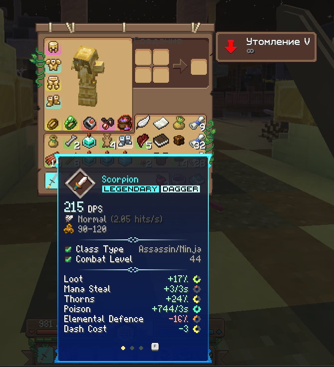</a></td><td valign="top"><a href="docs/images/item-wynn-ru.png">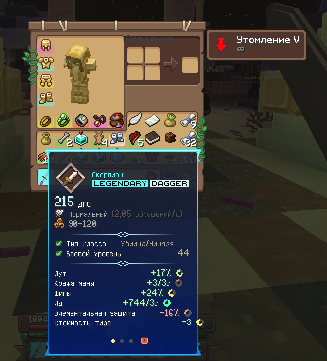</a></td><td valign="top"><a href="docs/images/item-wynn-zh.png">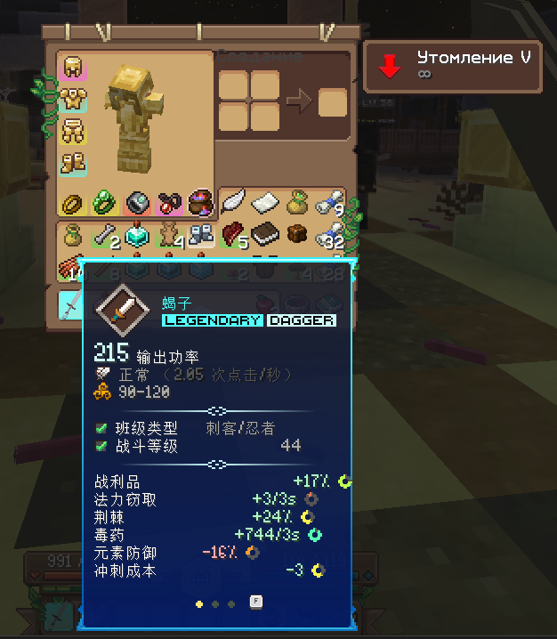</a></td></tr>
</table>

### Wynncraft dialogue inside the native frame

Translated prose appears inside the brown dialogue frame. The speaker label and SHIFT prompt stay original.

<table>
<tr><th>English — original</th><th>Russian</th><th>Chinese</th></tr>
<tr><td valign="top"><a href="docs/images/dialogue-wynn-en.png">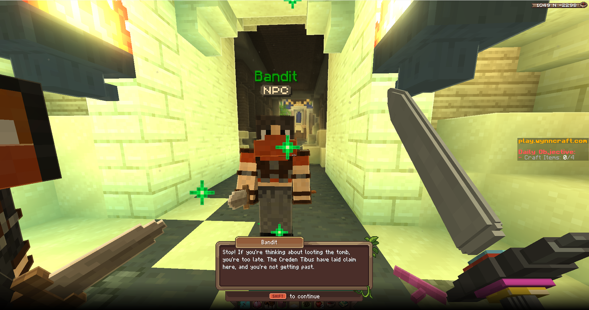</a></td><td valign="top"><a href="docs/images/dialogue-wynn-ru.png">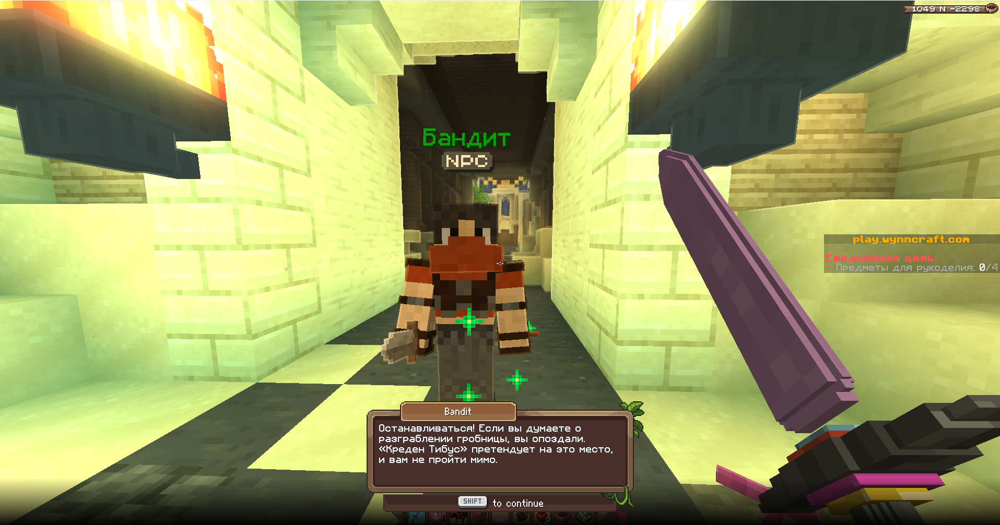</a></td><td valign="top"><a href="docs/images/dialogue-wynn-zh.png">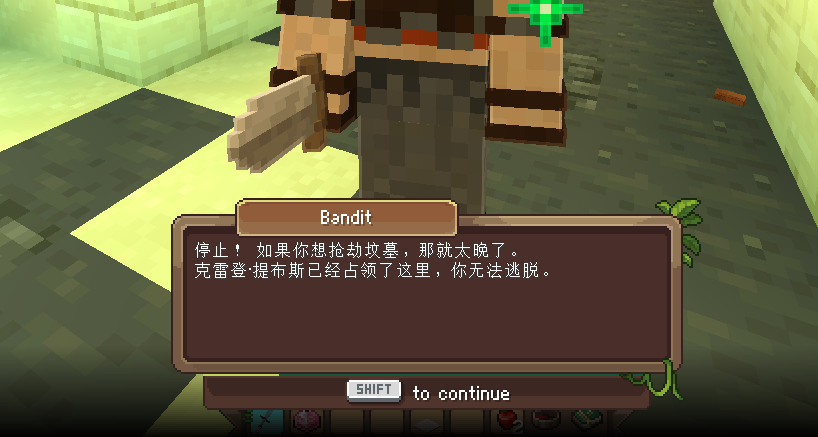</a></td></tr>
</table>

### NPC names

Bandit → Бандит. Entity-name translation can be disabled separately.

<table>
<tr><th>English — original</th><th>Russian</th></tr>
<tr><td valign="top"><a href="docs/images/npc-wynn-en.png">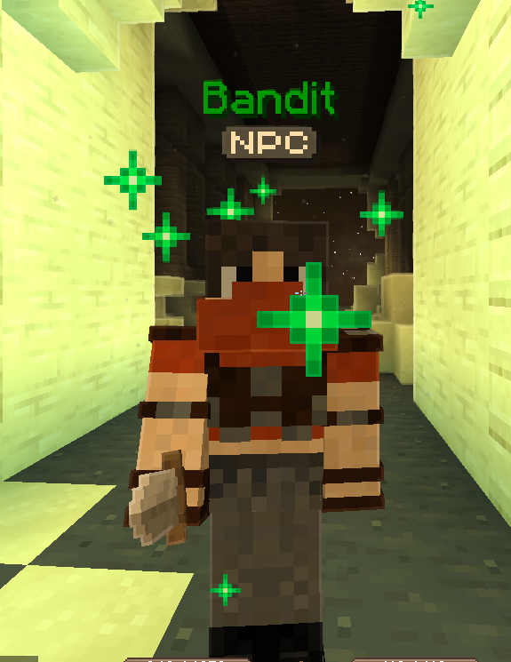</a></td><td valign="top"><a href="docs/images/npc-wynn-ru.png">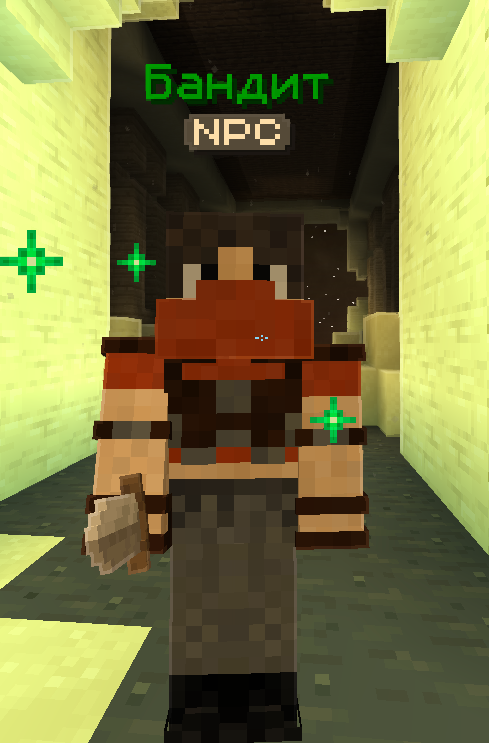</a></td></tr>
</table>

### Chat and NPC messages

Hypixel SkyBlock messages in English, Russian and Chinese. Button mode lets you switch between translation and original.

<table>
<tr><th>English — original</th><th>Russian</th><th>Chinese</th></tr>
<tr><td valign="top"><a href="docs/images/chat-hypixel-en.png">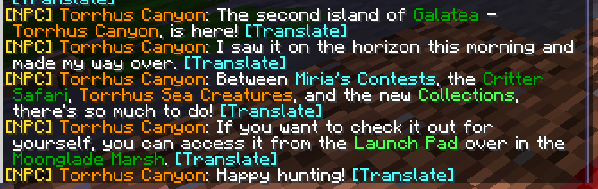</a></td><td valign="top"><a href="docs/images/chat-hypixel-ru.png">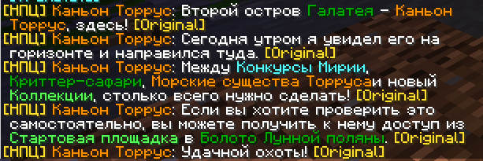</a></td><td valign="top"><a href="docs/images/chat-hypixel-zh.png">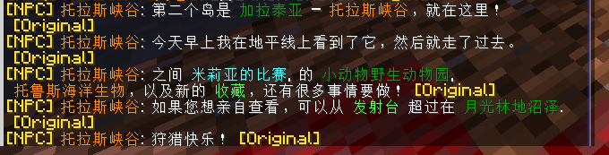</a></td></tr>
</table>

### Mod interfaces: Shine Studio

Press K in a supported interface. This example also shows current limitations: custom headings can be partially translated and longer text can overflow widgets.

<table>
<tr><th>English — original</th><th>Russian</th><th>Chinese</th></tr>
<tr><td valign="top"><a href="docs/images/shine-en.png">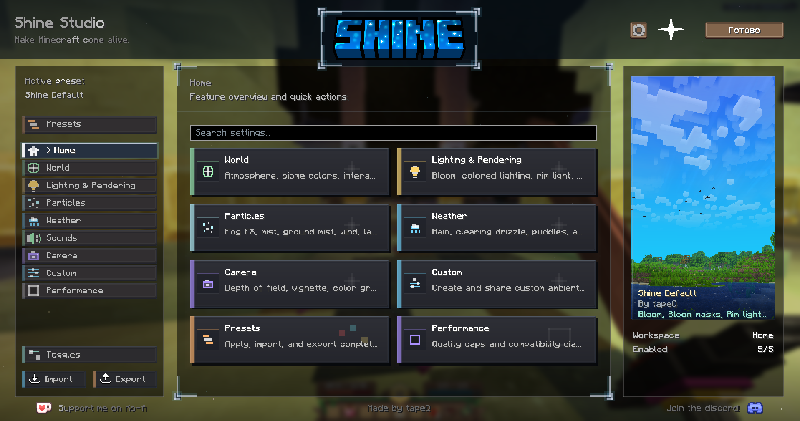</a></td><td valign="top"><a href="docs/images/shine-ru.png">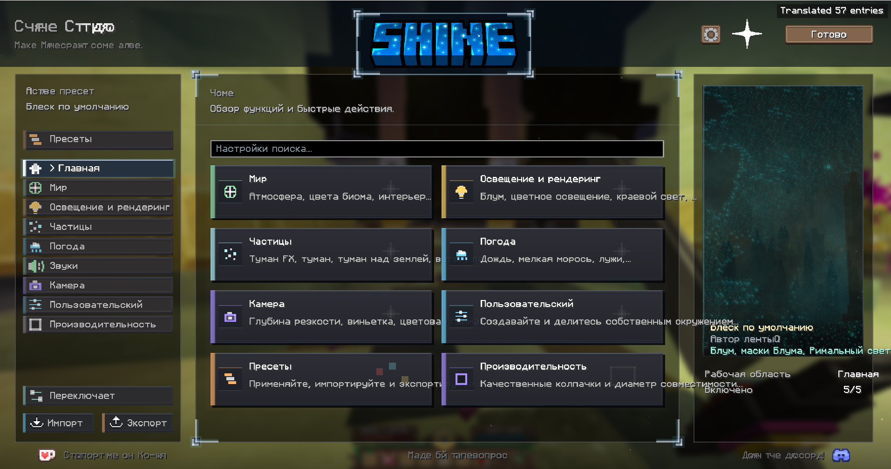</a></td><td valign="top"><a href="docs/images/shine-zh.png">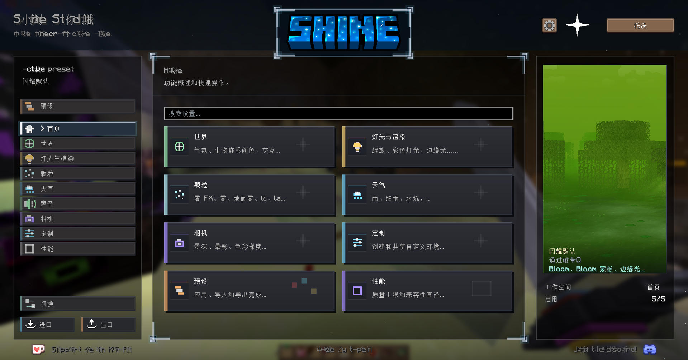</a></td></tr>
</table>

<details>
<summary>More examples: Hypixel, HUD and world text</summary>

#### Hypixel SkyBlock item

<table>
<tr><th>English — original</th><th>Russian</th></tr>
<tr><td valign="top"><a href="docs/images/item-hypixel-en.png">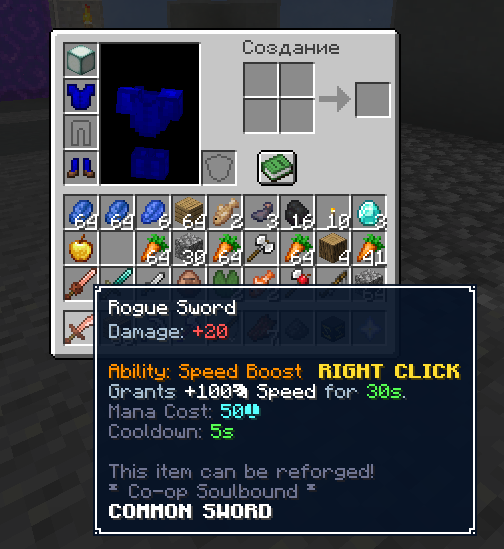</a></td><td valign="top"><a href="docs/images/item-hypixel-ru.png">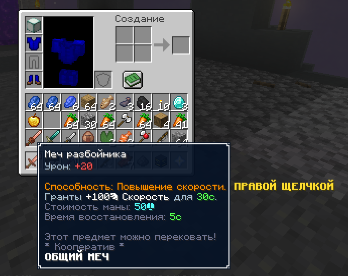</a></td></tr>
</table>

#### Objectives and scoreboard

<table>
<tr><th>English — original</th><th>Russian</th></tr>
<tr><td valign="top"><a href="docs/images/hud-hypixel-en.png">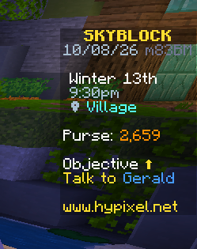</a></td><td valign="top"><a href="docs/images/hud-hypixel-ru.png">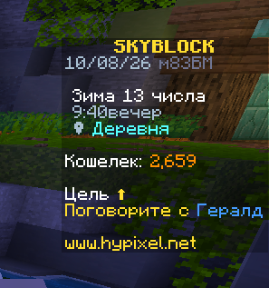</a></td></tr>
</table>

#### Wynncraft world labels

<table>
<tr><th>English — original</th><th>Russian</th></tr>
<tr><td valign="top"><a href="docs/images/world-wynn-en.png">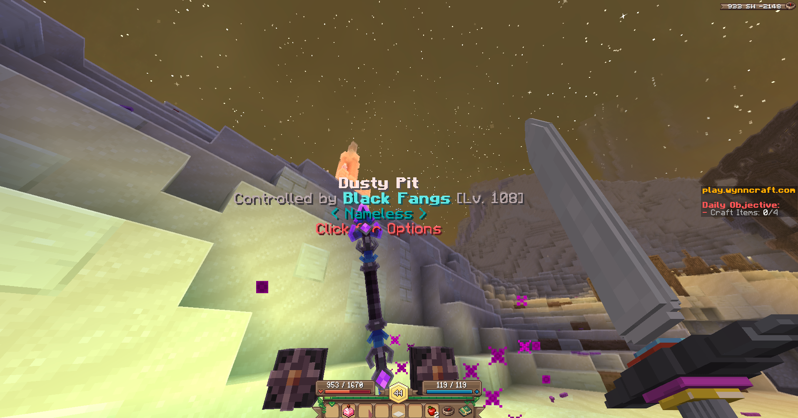</a></td><td valign="top"><a href="docs/images/world-wynn-ru.png">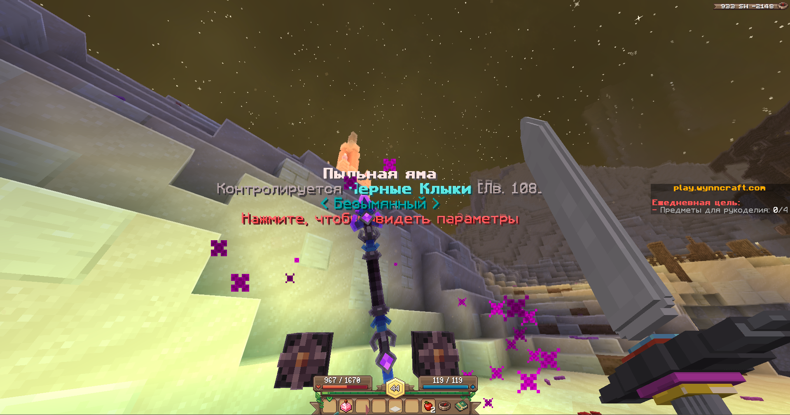</a></td></tr>
</table>

#### Hypixel shop: three languages

<table>
<tr><th>English — original</th><th>Russian</th><th>Chinese</th></tr>
<tr><td valign="top"><a href="docs/images/shop-hypixel-en.png">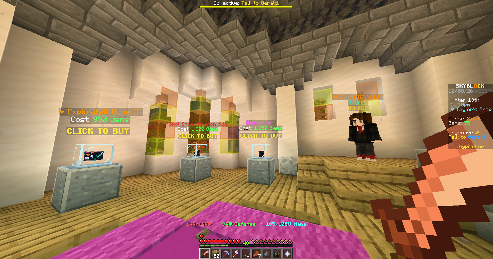</a></td><td valign="top"><a href="docs/images/shop-hypixel-ru.png">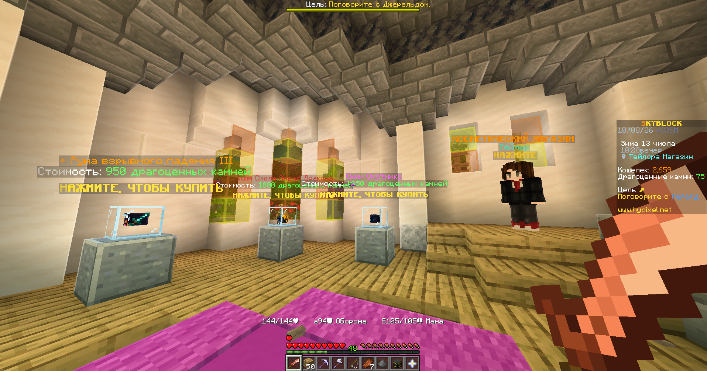</a></td><td valign="top"><a href="docs/images/shop-hypixel-zh.png">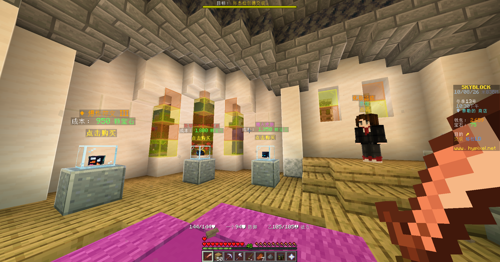</a></td></tr>
</table>

</details>

## Install and start

**Minecraft Java 26.2 · Fabric · Free and open source · MIT**

1. Use **Minecraft Java Edition 26.2** with **Fabric Loader** and **Fabric API for 26.2**. Tested with Loader **0.19.5**, Fabric API **0.155.2+26.2**, and Java **25**.
2. Download the `.jar` from [Releases](https://github.com/mirray-u/Translate-Any-Server-and-Mod/releases/latest) and put it in your instance's `mods` folder. Remove any other SimpleTranslate JAR first: both use the same mod ID.
3. Start Minecraft. Google is already selected, the source language is automatic and the target is Russian. Change the languages in settings if needed.
4. Open settings with **U** by default, or through optional **Mod Menu**. No server-side installation is needed for client translation.

| Action | How |
|---|---|
| Translate the current interface | **K**, when GUI translation is enabled. K starts translation; it is not an original/translation toggle. |
| Temporarily show original text | **Shortcuts → Hold to Show Original**: enable the master switch and assign a key for **GUI text** or another surface. Hold the key to view the original. |
| Translate a tooltip on demand | **V**, after selecting the shortcut trigger mode. |
| Translate selected signs | In **Manual Selection** mode: **G** starts/stops selection; **H** submits. |
| Translate and send chat | Enable **Translate Sent Chat**, set the server language, then **Ctrl+Enter**. |
| Correct a translation | Edit its entry in **Translated Cache**. |

Translations are saved locally and reused after restarting. A changed text, language, provider or cache policy can require a new translation. The download contains no player config or gameplay cache.

## What it can translate

- Item names, descriptions, stats and hover tooltips.
- Chat and NPC messages, automatically or on demand.
- Wynncraft dialogue inside the server's original dialogue frame.
- NPC/entity names, text displays and signs.
- Scoreboards, boss bars, titles, action bars and objectives.
- Books and supported mod interfaces, including the Shine Studio example above.
- Your outgoing chat: enable **Translate Sent Chat** and use **Ctrl+Enter**.

Choose the source and target language in settings. **Auto → Russian** is the default; other supported languages can be selected or entered as a custom language code.

## What changed from SimpleTranslate

| Area | This fork adds or changes |
|---|---|
| Translation provider | Keyless Google web translation, selected by default; no local model is required. |
| Model API | Retained as an optional provider. Only the selected provider handles translation; there is no automatic switch between Google and AI. |
| Wynncraft dialogue | Translated prose inside the native brown frame, while preserving the speaker label, controls and visible response layout. |
| Long dialogue | Wraps lines and scales prose down when necessary. If it cannot fit even at 60%, the original remains visible. |
| Requests | Batches nearby text, coalesces duplicate requests, gives dialogue priority, paces Google requests and pauses on rate limits. |
| Stored data | Uses a separate `config/simple_translate_web` directory; original SimpleTranslate/LM Studio caches are not automatically imported. |

Chat, item, book, sign and interface support, cache tools and configurable shortcuts build on the original mod. This is a fork, not an official SimpleTranslate release.

## Compatibility and privacy

The mod works across server and mod text that its rendering hooks can read; **it does not guarantee that every element of every mod or server is translated**. Unusual renderers and custom fonts can require separate support. Text baked into images/textures is not recognized. The Shine screenshots show some partial translations and widget overflow.

Language detection also has limits: Latin text can be skipped when targeting English, and other Cyrillic languages can be skipped when targeting Russian. The screenshots demonstrate English → Russian and English → Chinese, not every possible language pair.

**Text selected for translation is sent to Google in Google mode, or to your configured model endpoint in Model API mode.** Google uses unofficial web endpoints: an internet connection is required and availability, rate limits and latency are not guaranteed. Failed translations keep the original visible. Model prompts and AI history are not sent to Google. The optional server cache sharing feature sends cache entries to a compatible server only when enabled.

## Source and build

The complete modified Fabric 26.2 source and tests are in [`fabric/SimpleTranslate-Fabric-26.2`](fabric/SimpleTranslate-Fabric-26.2). Other Minecraft versions are not included in this fork.

With JDK 25, from that folder:

```text
gradlew.bat test build
```

On Linux/macOS: `sh gradlew test build`. Add `-PliveGoogleTest` for the optional live Google tests. Build output is under `build/libs`. The published runtime is **2.2.1-web.6**, matching the maintainer's verified installed JAR. Its checksum is included in the release.

## Credits and license

Original mod: **baokaixina — [SimpleTranslate](https://github.com/baokaixina/SimpleTranslate)**. Google web integration and Wynncraft native dialogue changes: **mirray-u**, developed with AI assistance. The original MIT copyright notice is preserved in [LICENSE](LICENSE).

Wynncraft, Hypixel and Shine Studio are shown as compatibility examples; their names and visuals belong to their respective creators. This project is not affiliated with or endorsed by those projects, Google, Mojang or Microsoft.
